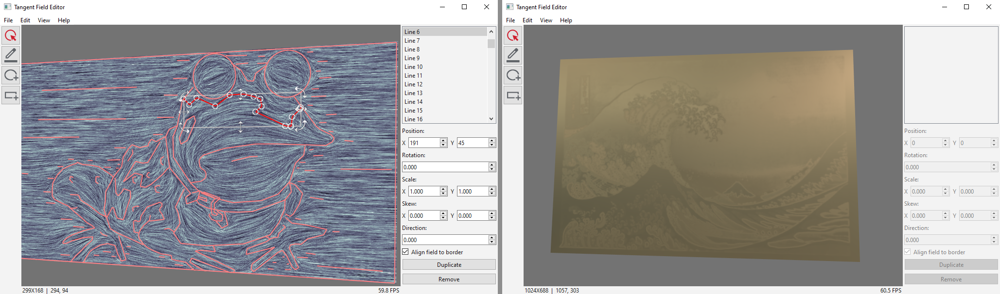

# Tangent Field Editor
This editor allows editing 2D tangent fields and rendering in real-time the anisotropic appearance defined by such fields. This project is the result of my internship in the team [MFX](https://mfx.loria.fr/) on the occasion of my master's [thesis](https://drive.google.com/file/d/1iu_zLZyRdtY2Du09JKbdB2y5B_ygdd7k/view?usp=drive_link).

## Rendering
The rendering algorithm was accepted for [PG2024](https://pg2024.hsu.edu.cn/). The relevant file is located at `src/Render/Shaders/fast.frag`.

For further information refer to the [project page](https://xavierchermain.github.io/publications/aniso-ibl).

## Usage
For further information about the usage please refer to the help menu or alternatively, you can see the same information [here](assets/help.md).

## Building
To build on both Windows and Linux the following dependencies are required:
- [Qt 6.7+](https://www.qt.io/download-dev)
- [Vulkan SDK](https://vulkan.lunarg.com)

We advise using Qt creator for the building, nevertheless, this is not strictly required. Opening the project file `Editor.pro` and selecting `Build -> Build Project "Editor"` should suffice.

Linux version was tested on `Majaro 24.0.4`. Using `pacman -S qtcreator make` on a fresh install was enough to get the project compiling and running. If you are using a different distribution other dependencies might be needed.

Building on MacOS would require not trivial work as Vulkan is not currently supported on that system natively and alternatives such as MoltenVK would have to be used.
